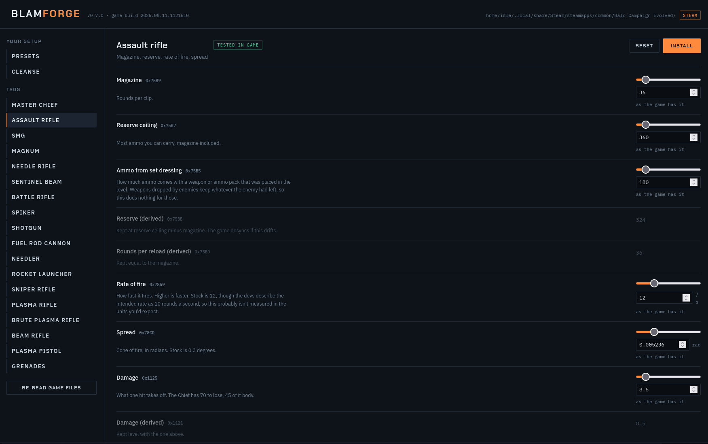

# Blamforge

Sliders for Halo: Campaign Evolved. Magazine sizes, shield strength, how fast your shields come back, sentinel beam battery. Things you'd otherwise be changing with a hex editor.



## What you need

Two things: Python, and a tool called [retoc](https://github.com/trumank/retoc) that does the actual reading and writing of the game's containers. Blamforge is the offsets (which took a while to find) and a web UI to wrangle them with.

### Windows

Open PowerShell and run these:

```
winget install --id Python.Python.3 --source winget --accept-package-agreements --accept-source-agreements
powershell -ExecutionPolicy Bypass -c "irm https://github.com/trumank/retoc/releases/download/v0.1.5/retoc_cli-installer.ps1 | iex"
```

Both put themselves on PATH. **Close PowerShell and open it again** afterwards or neither will be found.

>If `winget` isn't recognised, your App Installer is out of date. Get Python from python.org instead and tick "Add Python to PATH" during the install.

>If typing `python` opens the Microsoft Store instead of running anything, that's Windows' app execution aliases getting in the way. Settings, Apps, Advanced app settings, App execution aliases, turn off the `python.exe` and `python3.exe` entries.

Check retoc is found:

```
retoc --version
```

If that errors, Blamforge will tell you the same thing when you start it.

### Linux

Python is usually already there. For retoc:

```
curl -fL -o retoc.tar.xz https://github.com/trumank/retoc/releases/download/v0.1.5/retoc_cli-x86_64-unknown-linux-gnu.tar.xz
tar -xJf retoc.tar.xz
install -m 0755 $(find . -maxdepth 3 -type f -name retoc | head -1) ~/.local/bin/retoc
retoc --version
```

The `find` is because the archive puts the binary in a subdirectory whose name changes between releases.

`~/.local/bin` is on PATH on most distros. If it isn't, put it somewhere that is, or next to `blamforge.py`.

The [releases page](https://github.com/trumank/retoc/releases) has builds for other architectures if you need one.

#### Or build it with cargo

Building retoc from source works too, but use `--locked`:

```
git clone https://github.com/trumank/retoc && cd retoc
git checkout v0.1.5
cargo build --release --locked
```

Without that flag, cargo pulls a newer version of one of its dependencies which may break something.

Check retoc is found:

```
retoc --version
```

## Running it

```
python blamforge.py
```

> On linux it's safer to run `python3 blamforge.py`

A browser tab opens, then...

1. It looks for your Steam install. If it can't find it, paste the folder that has `Meteorite/Content/Paks` in it.
2. First time only, it unpacks the game container to get at the tags. A minute or two. It keeps about a dozen files and bins the rest. Your install isn't modified, this only reads from it.
3. Pick something and drag the sliders. Each one shows what the value was before you touched it.
4. Install. That builds the mod and puts it in its own folder under `Content/Paks`.

Remove undoes it.

Launch the game and enjoy. Blamforge doesn't need to be running.

## What's in it

| | | |
|---|---|---|
| Master Chief | shields, health, recharge delay and time | tested |
| Assault rifle | mag, reserve, starting ammo, RPM, spread | tested |
| SMG | mag, reserve, starting ammo | tested |
| Sentinel beam | battery drain, heat | tested |
| BR, DMR, spike rifle, shotgun, needler, sniper, rockets, GL, fuel rod, concussion | mag, reserve, starting ammo | offsets check out, haven't played them |

No plasma weapons yet. They run on a battery instead of a magazine, same as the sentinel beam, and I haven't gone looking for those fields.

## Uninstalling

Each mod is its own folder under `Content/Paks`, named `bf_` and then whatever you changed, with a `blamforge.txt` in it saying what was changed and when. The Remove button deletes the folder, and so does deleting it yourself.

If you've binned Blamforge and still have mods installed:

```
python uninstall.py
```

> On linux it's safer to run `python3 uninstall.py`

That lists what's there. Add a name to remove one, or `--all` for everything. It only touches folders with that text file in them, so nobody else's mods get caught up in it.

Close the game first. Windows won't let you delete files something else has open.

## Platforms

Written and tested on Linux. It should run anywhere python and retoc do, and it looks in the usual Windows/Linux Steam locations, but I've only ever used it on Linux myself. If something breaks elsewhere, say so.

## How it works, roughly

Gameplay values live in Blam engine tags packed inside Unreal's IoStore containers. Once a tag's out, the numbers are ints and floats at fixed offsets. `registry.json` is a list of those offsets and the value each one holds in a clean install, and Blamforge checks that value matches before it writes anything. If it doesn't, you've got a mod installed already, or you've patched the file before, or the game updated and everything moved.

Finding new offsets is written up in CONTRIBUTING.md.

## Potential hazards

Offsets were checked against build 2026.08.11.1121610. I cannot promis it will work beyond that.

A fair bit isn't reachable from tags at all. Damage resistance, the difficulty skulls, anything to do with player traits. That stuff lives in Unreal-side code and, as far as I'm aware, no amount of tag editing gets near it. [UE4SS](https://github.com/UE4SS-RE/RE-UE4SS) is the tool for that, not this one. Checkout NexusMods for UE4SS mods.

Linux users - You prob know better, but I didn't think about this at the time. If you go extracting containers yourself, don't do it into `/tmp`. On a lot of setups that's a RAM disk, and pakchunk0 is 106,000 files. It'll fill up and truncate silently, and you'll spend an evening convinced the file you're looking for doesn't exist. Ask me how I know.

## Files

Offsets, not game data. Bring your own copy of the game. I cannot upload the game data. That's a 'tsk tsk'

## Privacy

Server binds to a free port on `127.0.0.1` and makes no outbound requests. Nothing leaves your machine.

## Version

See CHANGELOG.md. The version in `registry.json` is Blamforge's own. The `build` field next to it is the game build the offsets came from.

## Thanks

retoc and repak are [trumank's](https://github.com/trumank), and this doesn't work without them.

The Chief recharge values were difficult to find, thankfully [Chance_25](https://www.nexusmods.com/profile/Chance255) set them in [Chief Shield and Health Recharge Overhaul](https://www.nexusmods.com/halocampaignevolved/mods/226)

MIT licensed.
